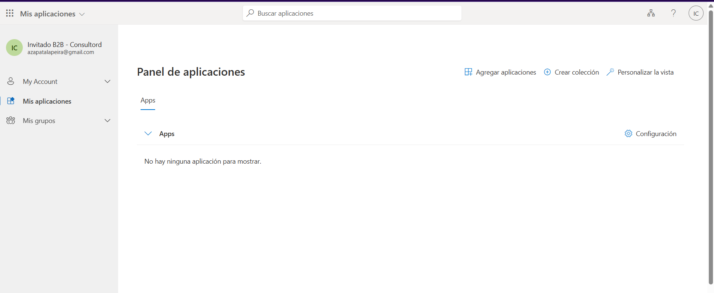
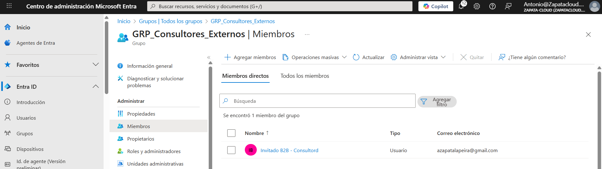

# Azure-Lab-04-B2B-Invitados
🧪 LAB 04: Colaboración B2B (Invitados Externos)
# Lab 04: Colaboración Segura con Invitados (B2B)

## 🎯 Objetivo
Permitir acceso a terceros usando sus credenciales, sin gestionar contraseñas internas.

## 🛠️ Tareas realizadas
1. Invitación B2B y proceso de aceptación.
2. Gestión de acceso mediante grupos (acceso por grupo, no individual).

## 📸 Evidencias

**Usuario Guest Accepted:**  

**Grupo de externos (invitado añadido):**  

## ✅ Checklist de verificación
- [x] Invitado aparece como Guest
- [x] Estado Accepted
- [x] Acceso siempre por grupos (no individual)

## 🗣️ Qué le diría al cliente / entrevista
“B2B evita gestionar credenciales de terceros y facilita revocación rápida por grupo”.
