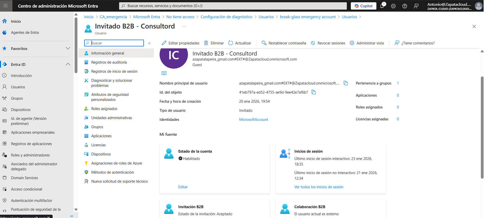

# Lab 04 — Colaboración Segura con Invitados (B2B) | Microsoft Entra ID

## Contexto (por qué lo hice)
En entornos reales es habitual dar acceso temporal a **consultores, proveedores o partners**.  
Con **Microsoft Entra B2B**, el invitado usa **sus propias credenciales** (no gestiono contraseñas internas) y el acceso se gobierna de forma limpia mediante **grupos** (alta/baja rápida y trazable).

## Objetivo
Permitir acceso a terceros mediante **B2B** y gobernar permisos con **grupos**, manteniendo control y facilidad de revocación.

---

## Tareas realizadas
1. Invitación B2B a un correo externo real.
2. Creación del grupo `GRP_Consultores_Externos` y asignación del invitado al grupo.
3. Aceptación de la invitación por parte del invitado (acceso verificado).
4. Verificación en Entra del estado **Guest** + invitación **Aceptada**.

---

## Evidencias

### 1) Grupo `GRP_Consultores_Externos` con el invitado añadido

### 2) Invitado accede tras aceptar (ventana incógnito)

### 3) Usuario registrado en Entra como **Guest** con invitación **Aceptada**
> Captura del perfil del usuario invitado en Entra donde se ve **Guest** y el estado de la invitación **Aceptado**.

> Nota: se omite la captura del email recibido para evitar ruido y exposición de datos innecesarios.

---

## Checklist de verificación
- [x] Invitado aparece como **Guest**
- [x] Invitación con estado **Aceptado**
- [x] Acceso gestionado por **grupos** (no individual)

---

## Qué explicaría en una entrevista / a un cliente
“Con B2B permito colaboración con terceros sin gestionar sus credenciales. El acceso se asigna por **grupos**, lo que facilita altas/bajas rápidas y revocación inmediata, manteniendo control y trazabilidad.”
